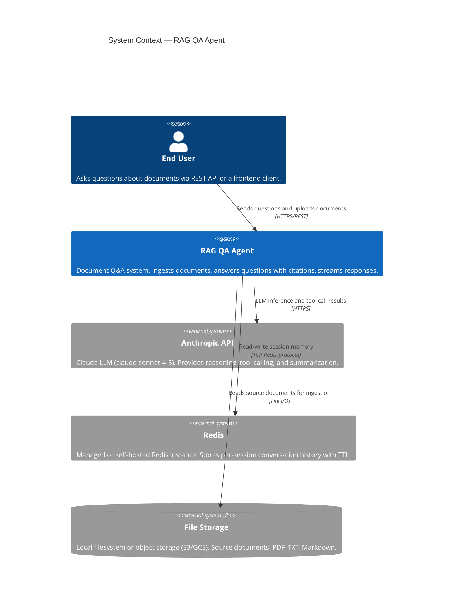

# C4 Level 1 — System Context

This diagram shows the `rag-qa-agent` system and its relationships with external actors and systems.

## Key Relationships

| From | To | Purpose |
|---|---|---|
| User | RAG QA Agent | Submit questions, upload documents |
| RAG QA Agent | Anthropic API | LLM calls (streaming + sync) |
| RAG QA Agent | Redis | Session memory persistence |
| RAG QA Agent | File Storage | Document ingestion source |

## External Dependencies

- **Anthropic API**: Only external paid API. Requires `ANTHROPIC_API_KEY`. All LLM inference (question answering, summarization) flows through this.
- **Redis**: Can be the bundled Docker container (development) or a managed service like AWS ElastiCache (production).
- **File Storage**: Documents are read from disk at ingest time. The Chroma vector store persists embeddings separately.
