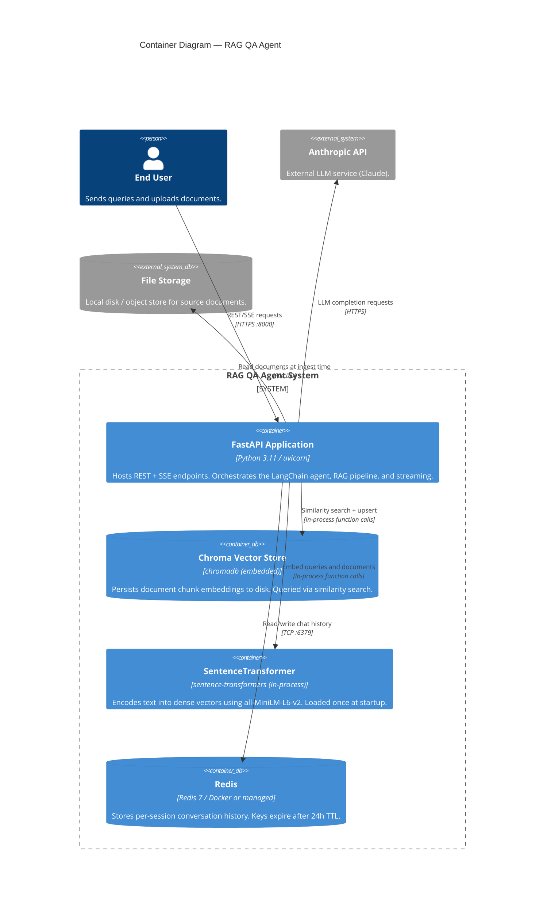

# C4 Level 2 — Container Diagram

This diagram shows the deployable containers within the `rag-qa-agent` system boundary.

## Container Descriptions

| Container | Technology | Responsibility |
|---|---|---|
| **FastAPI Application** | Python 3.11, uvicorn | REST API, agent orchestration, document ingestion, SSE streaming |
| **Chroma Vector Store** | chromadb (embedded) | Persist and query document chunk embeddings |
| **SentenceTransformer** | sentence-transformers | In-process embedding model; no external API key required |
| **Redis** | Redis 7 | Session-scoped conversation memory; auto-expires after TTL |

## Deployment Notes

- **Development**: all containers run via `docker-compose up`. Chroma data and the Redis append-only log are persisted via named volumes.
- **Production**: The FastAPI app can be scaled horizontally (multiple replicas) because all state lives in Redis (session memory) and Chroma (persisted to a shared volume or migrated to a managed vector DB like Qdrant).
