# C4 Level 3 — Component Diagram

This diagram zooms into the **FastAPI Application** container and shows its internal components.

```mermaid
C4Component
  title Component Diagram — FastAPI Application

  Person(user, "End User")

  Container_Boundary(app, "FastAPI Application") {

    Component(mainPy, "App Factory (main.py)", "FastAPI lifespan", "Creates the app, mounts routers, pre-loads embedding model and Chroma store at startup.")

    Component(chatRouter, "Chat Router", "FastAPI APIRouter", "POST /chat and POST /chat/stream. Delegates to AgentExecutor. Streams SSE tokens.")
    Component(docsRouter, "Documents Router", "FastAPI APIRouter", "POST /documents/ingest and GET /documents.")
    Component(schemas, "Schemas (schemas.py)", "Pydantic v2 models", "ChatRequest, ChatResponse, IngestResponse, DocumentListResponse, HealthResponse.")

    Component(agentFactory, "Agent Factory (agent.py)", "LangChain", "create_agent(session_id) wires LLM + tools + memory into an AgentExecutor.")
    Component(prompts, "Prompts (prompts.py)", "LangChain ChatPromptTemplate", "System prompt + chat history + scratchpad template.")
    Component(memory, "Redis Memory (memory.py)", "RedisChatMessageHistory", "Per-session ConversationBufferWindowMemory backed by Redis.")

    Component(toolRetriever, "retrieve_documents tool", "LangChain @tool", "Semantic search over Chroma. Returns top-k chunks with source citations.")
    Component(toolSummarizer, "summarize_document tool", "LangChain @tool + Claude", "Calls Claude directly with a summarization prompt.")
    Component(toolCalc, "calculator tool", "LangChain @tool + AST", "Safe whitelist-based arithmetic evaluator. No arbitrary code execution.")

    Component(ingestion, "Ingestion Pipeline (ingestion.py)", "LangChain loaders + splitter", "Load → chunk → enrich metadata → embed → upsert to Chroma.")
    Component(chromaRetriever, "Chroma Retriever (retriever.py)", "langchain-chroma", "add_documents(), similarity_search(), list_sources() wrappers.")
    Component(embeddings, "Embeddings (embeddings.py)", "SentenceTransformer", "LangChain Embeddings adapter. Singleton model loaded once.")
  }

  ContainerDb(chroma, "Chroma DB", "Vector store")
  ContainerDb(redis, "Redis", "Session store")
  System_Ext(anthropic, "Anthropic API", "Claude LLM")

  Rel(user, chatRouter, "POST /chat or /chat/stream", "JSON / SSE")
  Rel(user, docsRouter, "POST /ingest or GET /documents", "multipart/JSON")
  Rel(chatRouter, agentFactory, "create_agent(session_id)")
  Rel(agentFactory, prompts, "get_agent_prompt()")
  Rel(agentFactory, memory, "get_session_memory(session_id)")
  Rel(agentFactory, toolRetriever, "bind tool")
  Rel(agentFactory, toolSummarizer, "bind tool")
  Rel(agentFactory, toolCalc, "bind tool")
  Rel(memory, redis, "read/write history", "TCP")
  Rel(toolRetriever, chromaRetriever, "similarity_search()")
  Rel(toolSummarizer, anthropic, "summarization LLM call", "HTTPS")
  Rel(agentFactory, anthropic, "agent LLM calls (streaming)", "HTTPS")
  Rel(docsRouter, ingestion, "run(file_path)")
  Rel(ingestion, chromaRetriever, "add_documents()")
  Rel(chromaRetriever, embeddings, "embed_documents() / embed_query()")
  Rel(chromaRetriever, chroma, "persist + query", "in-process")

  UpdateLayoutConfig($c4ShapeInRow="4", $c4BoundaryInRow="1")
```

## Component Responsibilities

| Component | Module | Key Responsibility |
|---|---|---|
| App Factory | `app/main.py` | FastAPI lifespan, router registration, startup pre-loading |
| Chat Router | `app/api/routes/chat.py` | Sync + streaming chat endpoints |
| Documents Router | `app/api/routes/documents.py` | File upload ingestion + source listing |
| Schemas | `app/api/schemas.py` | Typed request/response models |
| Agent Factory | `app/agent/agent.py` | Wire LLM + tools + memory → AgentExecutor |
| Prompts | `app/agent/prompts.py` | System prompt with tool guidance |
| Redis Memory | `app/agent/memory.py` | Session-scoped chat history via Redis |
| Retriever Tool | `app/agent/tools/retriever.py` | Semantic document search |
| Summarizer Tool | `app/agent/tools/summarizer.py` | Targeted Claude summarization |
| Calculator Tool | `app/agent/tools/calculator.py` | Safe AST-based math eval |
| Ingestion Pipeline | `app/rag/ingestion.py` | Load → chunk → metadata → store |
| Chroma Retriever | `app/rag/retriever.py` | Vector DB operations |
| Embeddings | `app/rag/embeddings.py` | SentenceTransformer → LangChain adapter |
