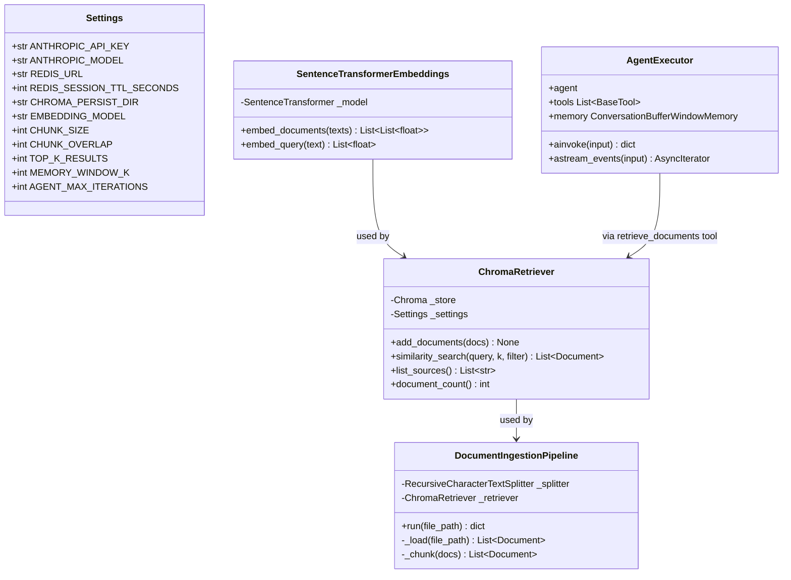
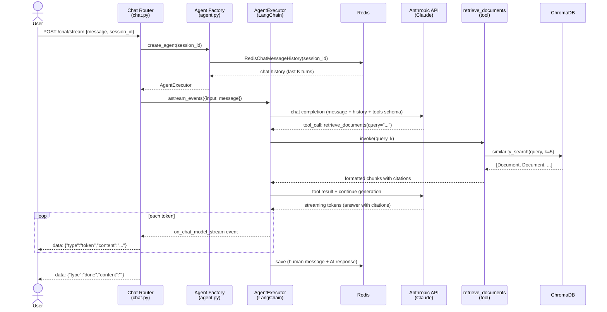
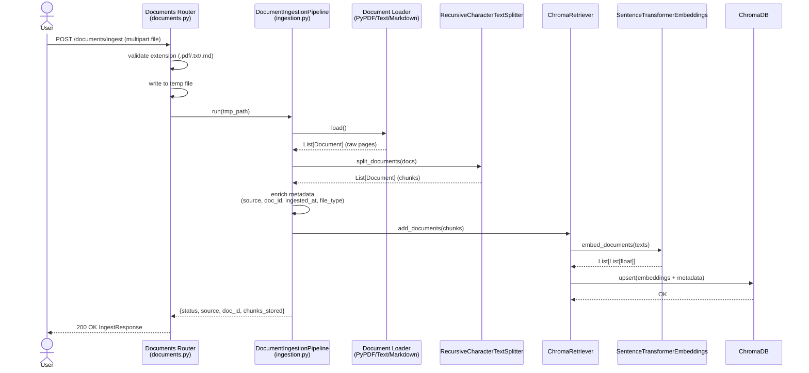
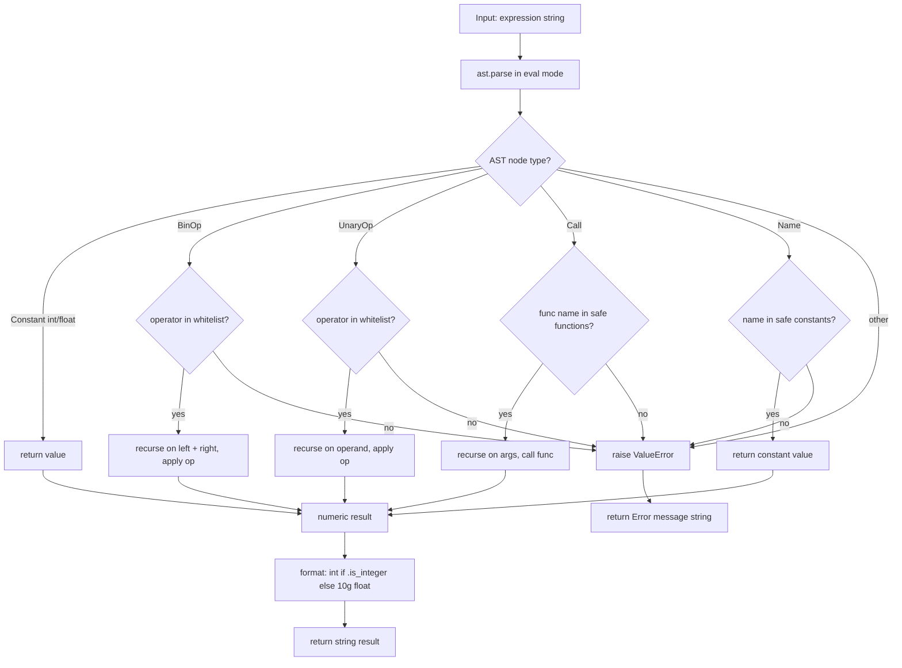

# C4 Level 4 — Code Diagrams

This level documents the key class structures and runtime data flows for the two most complex subsystems.

---

## Class Diagram: Core Classes

---

## Sequence Diagram: Streaming Chat Request

Shows the full request lifecycle for `POST /chat/stream`.

---

## Sequence Diagram: Document Ingestion

Shows the lifecycle for `POST /documents/ingest`.

---

## Calculator Tool: AST Evaluation Flow

